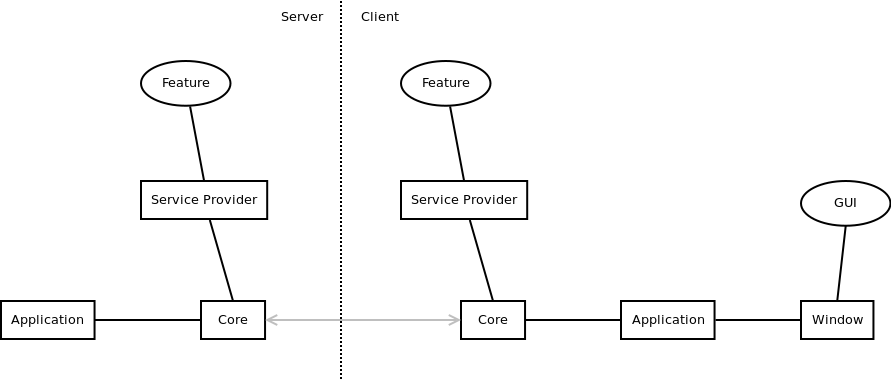

# Overview

*Simplified diagram of components and their relation.*

## Build System

Building is done with [Webpack](https://webpack.js.org/). See [configuration article](config/README.md#webpack) for what loaders and plugins are used.

## Client

The client is written in vanilla JavaScript (ES2015+) and Sass (CSS) and split up into several [modules](../official/README.md) which are bundled together.

Runs in any modern browser (IE10+) including mobile.

## Server

The server runs Node (v8.x or later) on [Express](https://expressjs.com/) and by default only serves static files.

Service Providers and Applications can hook into the startup procedure to add Middleware, Routes and other functionality not related to the HTTP Server.

A WebSocket server is also created to allow for more flexible communication between the client and server.

## Service Providers

[Service Providers](../../tutorial/provider/README.md) registers services (features) in the core that can be used anywhere in the codebase.

All standard features comes in providers which makes it easy to swap out for custom or third party alternatives.

## Packages

### Applications

An application consists of three parts:

#### Metadata

The [metadata](../../tutorial/application/README.md#metadata) file contains information that describes your application, what files to load (from webpack output, etc) and other information related to how it interacts with the underlying system(s).

#### Client script

Client scripts are bundled with Webpack via the build system. Upon launch, the files defined in metadata is loaded, where the main bundle [registers](../../tutorial/application/README.md) the application.

After a successful registration your code is executed. This is where you create your windows, UIs, communications, etc.

#### Server script

The server script loads when the server boots. Here you can run background tasks, set up HTTP or WebSocket requests to your client script(s), etc.

This script has the same interface as a Service Provider (init/start/destroy).

### Themes

A theme behaves much like an Application with exception of not having a server-side script.

## Startup procedure

When the core `.start()` method is called, this is what happens in order:

1. Service Providers are initialized
2. Authentication takes place (login prompt)
3. Service Providers are started
4. Package Manager loads manifest
5. Connection to server is established (websocket)
6. Reload session if available

