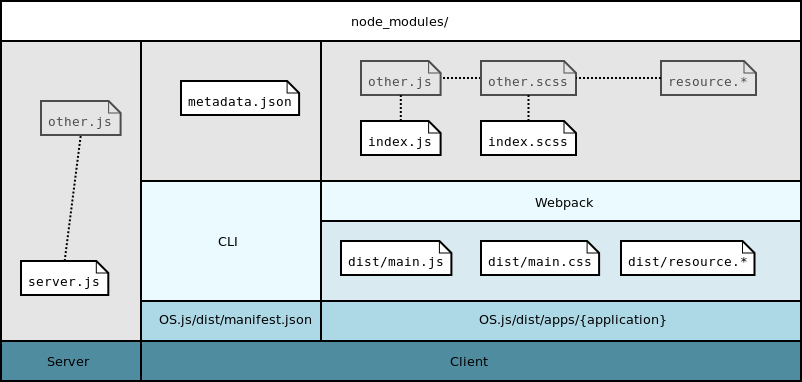

# Overview

This article gives a brief overview of all of the different components that makes up OS.js.

**See [development](../../development/README.md) for a more in-depth look at the development process.**


*Simplified diagram of components and their relation.*

## Source-code

All of the source is written in [ES6+](http://es6-features.org/).

Client-side scripts are transpiled with [Babel](https://babeljs.io/) and bundled with [Webpack](https://webpack.js.org/).

If you're not familiar with ES6 modules, you should read about the [`import`](https://developer.mozilla.org/en-US/docs/Web/JavaScript/Reference/Statements/import) and [`export`](https://developer.mozilla.org/en-US/docs/web/javascript/reference/statements/export) statements.

The server-side scripts runs on node 10+, but uses `require` instead of `import/export`.

## Distribution

The [OS.js repository](https://github.com/os-js/OS.js) contains a boilerplate you can use to build and bundle your own distributions.

It comes with the following structure, that you can modify as you see fit:

```text
webpack.config.js        Webpack building configuration
package.json             Dependency definitions
node_modules/            Dependencies (npm package)
dist/                    Build output
vfs/                     Filesystem storage
src/                     Sources
    packages/            Custom packages directory
    client/
        index.js         Client bootstrap script
        index.ejs        Base HTML template
        index.scss       Base CSS template
        config.js        Configuration(s)
        favicon.png      Favicon
    server/
        index.js         Server bootstrap script
        config.js        Configuration(s)
    cli/
        index.js         CLI bootstrap script
```


## Client

The client runs in any modern browser. The bundles are compiled down to ES5 whenever possible.

Most of the features in the client are provided by [service providers](../../guide/provider/README.md).

See the [official resources](../official/README.md) for modules.

You can read more about the standard provided services in the [Core Tutorial](../../tutorial/core/README.md#client-services).

## Server

The server runs on [Node.js](https://nodejs.org/) (version 10 or later) on [Express](https://expressjs.com/).

Most of the features in the client are provided by [service providers](../../guide/provider/README.md).

See the [official resources](../official/README.md) for modules.

## Building

Webpack configurations are defined in `webpack.config.js` in the root directory of all client-side modules and packages.

Usually a `index.js` and `index.scss` file are set up as entry-points in this configuration, which will create bundled output in the `dist/` folder.

The output is usually named `main.js` and `main.css` (and any resources imported `{dir/}{hash}.{extension}`).

## Modules

Modules come in several forms: [service provider](../../guide/provider/README.md), [cli task](../../guide/cli/README.md#custom-task), [authentication adapter](../../guide/auth/README.md), [settings adapter](../../guide/settings/README.md), [filesystem adapter](../../guide/filesystem/README.md).

See the [official resources](../official/README.md) for modules.

## Packages

Packages are divided into several types: [`application`](../../tutorial/application/README.md), [`theme`](../../tutorial/theme/README.md#styles) and [`icons`](../../tutorial/theme/README.md#icons). All of these types are set-up and built in the same way, so to keep this article brief it will focus on *applications*.

A simple diagram of how package files are built and consumed:



See the [official resources](../official/README.md) for packages.

