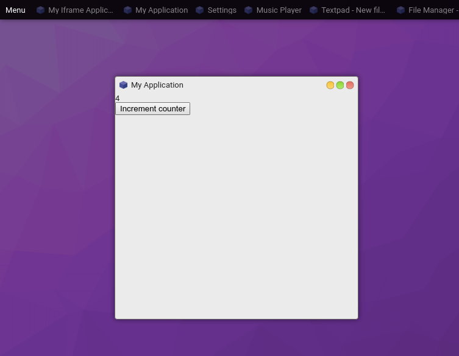

# GUI Tutorial

This turorial goes over how to create reactive UIs using components.

## Usage

OS.js uses [Hyperapp](https://hyperapp.js.org/) for its GUI components by default.

*This does not mean that you are restricted to usage of Hyperapp. You can use React, Vue or anything you like.*

## Basic Example



```javascript
import {h, app} from 'hyperapp';

const createView = (state, actions) => h('div', {}, [
  h('div', {}, String(state.counter)),
  h('button', {type: 'button', onclick: () => actions.increment()}, 'Increment counter')
]);

const createApp = (proc, win, $content) => {
  app({
    counter: 0
  }, {
    increment: () => state => ({counter: state.counter + 1})
  }, createView, $content);
};

// ...
win.render($content => createApp(proc, win, $content));

// Or if you've chained your calls when creating the window:

proc.createWindow(/* ... */)
  .render(($content, win) => createApp(proc, win, $content));
// ...
```

### Using Components


Use the provided GUI module:

```javascript
import {Box, BoxContainer, Button} from '@osjs/gui';

const createView = (state, actions) => h(Box, {}, [
  h(BoxContainer, {}, String(state.counter)),
  h(Button, {onclick: () => actions.increment(), label: 'Increment counter'})
]);
```

[](codepen://andersevenrud/Xodjmy?height=400&theme=0)

### JSX

You can also use JSX syntax instead of the programmatic approach.

First: `npm install --save-dev @babel/plugin-transform-react-jsx`

Then in your `.babelrc` file:

```json
{
  "presets": [
    "@babel/preset-env",
    ["@babel/plugin-transform-react-jsx", {
      "pragma": "h"
    }]
  ],
  "plugins": [
    "@babel/plugin-transform-runtime"
  ]
}
```

and then in your source:

```javascript
const createView = (state, actions) => (
  <div>
    <div>{state.counter}</div>
    <button type="button" onclick={() => actions.increment()}>Increment counter</button>
  </div>
);
```

## Contextmenu

You can create (context) menus via the GUI provider:

```javascript
core.make('osjs/contextmenu', {
  position: Event || Element || Object,

  menu: [{
    label: 'Some label',
    onclick: ev => console.log('Clicked')
  }, {
    label: 'Sub items',
    items: [{
      label: 'Sub item'
      onclick: ev => console.log('Clicked sub item')
    }, {
      label: 'Check item 1'
      checked: true,
      onclick: ev => console.log('Clicked sub item')
    }, {
      label: 'Check item 2'
      checked: true,
      onclick: ev => console.log('Clicked sub item')
    }]
  }]
});
```

You can also forcefully hide an open menu with `core.make('osjs/contextmenu').hide()`.

## Components

This is the list of standard GUI components.

All components uses Flexbox and supports the following props:

* `orientation` - Orientation of children (horizontal/vertical)
* `grow` - Grow factor (default `0`)
* `shrink` - Shrink factor (default `0`)
* `basis` - Base size (default `auto`)
* `align` - Align items
* `justify` - Justify content
* `margin / padding` - Padding/Margin (boolean/string/number for `Box`)

> Notes:
> 1. Non-container elements gets the flexbox model from the `box` property.
> 2. All components based on browser elements supports the standard properties.
>
> *The component set is under development*
>

### Containers

| Name                | Description                                   | Custom Props                                      |
| ------------------- | --------------------------------------------- | ------------------------------------------------- |
| Box                 | Flexbox container (padded)                    | *See above*                                       |
| BoxContainer        | Flexbox container (simple, like a `div`)      | *See above*                                       |
| Toolbar             | Flexbox container (spaced)                    | *See above*                                       |
| Menubar             | Toolbar, except for menus                     |                                                   |
| Tabs                | Tabbed container(s)                           | `{labels: [String,...]}`                          |
| Panes               | Resizeable container(s)                        | `{orientation: String, sizes: Array[Number,...]}` |

### Fields

All fields have extended events that passes on the current value:

```
onchange: (event, value) => {}
oninput: (event, value) => {}
```

| Name                | Description                                 | Custom Props                    |
| ------------------- | ------------------------------------------- | ------------------------------- |
| Button              | `<button>` Element                          | `{label: String, icon: String}` |
| RangeField          | `<input type="range" />` Field              |                                 |
| TextField           | `<input type="text,password,..." />` Field  |                                 |
| ToggleField         | `<input type="checkbox,radio" />`           |                                 |
| SelectField         | `<select>` Field                            | `{choices: Map<*, *>}`          |
| TextareaField       | `<textarea>` Field                          |                                 |

### Views

| Name                | Description                        | Custom Props |
| ------------------- | ---------------------------------- | ------------ |
| ListView            | A listview (not quite done)        |              |
| Iframe              | `<iframe>` View                    |              |
| Statusbar           | A statusbar with label             |              |

### Other

| Name                | Description                        | Custom Props           |
| ------------------- | ---------------------------------- | ---------------------- |
| Progressbar         | A progressbar with label           | `{value: Number}`      |
| Image               | `` element                  |                        |
| Video               | `<video />` element                |                        |

## Component Examples

### Basic Layout

A simple three-row layout:

```javascript
h(Box, {grow: 1, shrink: 1}, [
  h(BoxContainer, {}, 'Row 1'),
  h(BoxContainer, {}, 'Row 2'),
  h(BoxContainer, {}, 'Row 3')
])
```

[](codepen://andersevenrud/pqybGW?height=400&theme=0)

### Basic Layout, continued

Same as above, but contained within an outer `Box` with a `Menubar` and `Statusbar`

```javascript
h(Box, {grow: 1, shrink: 1}, [
  h(Menubar, {}, [
    h(MenubarItem, {onclick: () => alert('clicked')}, 'Menubar Item')
  ]),
  h(Box, {grow: 1}, [
    h(BoxContainer, {}, 'Row 1'),
    h(BoxContainer, {}, 'Row 2'),
    h(BoxContainer, {}, 'Row 3')
  ]),
  h(Statusbar, {}, 'Some status here')
])
```

[](codepen://andersevenrud/pqyEzp?height=400&theme=0)


### Using Inputs

Reactive value for inputs:

```javascript
app({
  myfield: 'Initial value'
}, {
  setValue: myfield => () => ({myfield})
}, (state, actions) => {
  return h(Box, {}, [
    h(TextField, {
      value: state.myfield,

      // All input comonents put in a second argument containing the value for certain input events
      oninput: (ev, value) => actions.setValue(value)
    })
  ]);
}, document.body);
```

[](codepen://andersevenrud/zyqKYM?height=400&theme=0)

### Using ListView

Certain components, like ListView needs some context and works a little bit different:

```javascript
import {listView} from '@osjs/gui'; // Lower-case l

const initialRows = [{
  columns: [1, 2, 3],
  data: {foo: 'bar'}
}];

app({
  mylistview: listView.state({
    // Set up the initial state
    columns: ['A', 'B', 'C'],
    rows: initialRows
 }),
}, {
  // Register callback actions
  mylistview: listView.actions({
    select: ({data, index, ev}) => console.log('Selected', data, index, ev),
    activate: ({data, index, ev}) => console.log('Activated', data, index, ev),
    contextmenu: ({data, index, ev}) => console.log('Menu', data, index, ev)
 }),
}, (state, actions) => {
  // Creates a new component based on the state and actions created
  const MyListView = listView.component(state.mylistview, actions.mylistview);

  h(Box, {grow: 1, shrink: 1}, [
    h(MyListView, {box: {grow: 1, shrink: 1}})
  ])
}, document.body);
```

[](codepen://andersevenrud/vvGXOO?height=400&theme=0)
